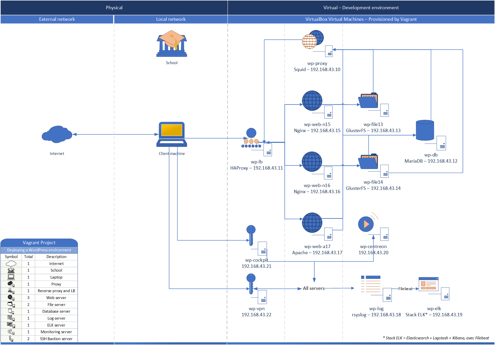

# Wordpress environment deployment with Vagrant



This project can be used to deploy a complete Wordpress install in less than an hour. Vagrant is used to deploy and provision all the virtual machines. The Vagrantfile included, and customizable, is used to deploy the following machines (defaults values are shown):

|  Qty  | Scalable |              Type               |  Package  |  Hostname  |        IP        |  CPU  |  RAM  |
| :---: | :------: | :-----------------------------: | :-------: | :--------: | :--------------: | :---: | :---: |
|   1   |    ❌     |              Proxy              |   squid   |  wp-proxy  |  192.168.43.10   |   2   |  2GB  |
|   1   |    ❌     | Load balancer and reverse proxy |  haproxy  |   wp-lb    |  192.168.43.11   |   2   |  2GB  |
|   1   |    ❌     |    Database (WordPress data)    |  mariadb  |   wp-db    |  192.168.43.12   |   1   | 1.5GB |
|   2   |    ✔     | File storage (WordPress files)  | glusterfs | wp-fileXX  | 192.168.43.13-14 |   1   | 1.5GB |
|   2   |    ✔     |        Nginx web servers        |   nginx   | wp-web-nXX | 192.168.43.15-16 |   1   | 1.5GB |
|   1   |    ✔     |       Apache web servers        |  apache2  | wp-web-aXX |  192.168.43.17   |   1   | 1.5GB |

> - **`XX`** in the hostname is replaced by the last two digits of the IP address.
> - All the machines access have been secured with iptables and iptables-persistent to make rules permanent even after rebooting the machine.

## Usage

> [VirtualBox](https://www.virtualbox.org/wiki/Downloads) is required to deploy this installation, as well as [Vagrant](https://www.vagrantup.com/downloads.html). The `vagrant-dotenv` plugin is used to load the passwords without displaying them in the `Vagrantfile` or in the git repo. The plugin [vagrant-env](https://github.com/gosuri/vagrant-env) is installed with `vagrant plugin install vagrant-env` or automatically during the first deployment.

Before executing any command, a `.env` file must be placed along with the `Vagrantfile` and filled with the four passwords used in the project in the following way :

```bash
# A template for this .env file is placed at the root of this project. You can copy it under the .env name and modify it to your needs.
HAPROXY_STATS_PASSWORD="Password for HAProxy stats"
DB_ROOT_PASSWORD="Root password for the database"
DB_USER_PASSWORD="Wordpress user password for the database"
WP_ADMIN_PASSWORD="Wordpress admin user password"
```

Once the environment variables are ready, the project can be deployed easily with one command : `vagrant up` from the project folder.

However, with the default values, some configurations of machines may fail due to network changes or computer resources. With my cellular network share, the network `192.168.43.0/24` is used and I took the 10 to 17 IP range. Moreover, deploying these 8 machines can only run in a computer with at least 16 GB of RAM. An i7 CPU is also recommended. All of these settings are customizable, as described in the following section

## Common parameters and configuration

Some scripts in this projects are applied to all the machines, configuring some basics things in each system. Most of these scripts use an hash of variables declared in the beginning of the **`Vagrantfile`**. This hash, named `vm_params`, contains all the informations of the project environment. It allows to :

- Define each hostname and IP address of the machines with *`xxxx_hostname`* and *`xxxx_ip`*. The IP address corresponds to the bridged interface and is unique for the proxy, load balancer, and database. For the file storage, apache and nginx servers, a range of following IP addresses is defined and tells how many copies of the machines should be deployed. For one machine, the start of the range (*`xxxx_ip_start`*) and the end of the range (*`xxxx_ip_end`*) are set equally. Otherwise, the number of machines is the difference between the end of the range and the start of the range. For simplicity in the scripts, this only works with a range smaller than a `/24` or `255.255.255.0` network.
- Define the base of IP for ranges with `range_ip_base`. By default, it is `192.168.43.` and is completed with a final number when a range of IP is used.
- Define the `netmask` for all machines and defaulting to `255.255.255.0` which is high enough for this project.
- Define which interface is bridged with `bridgedif`. This is the name of the interface as displayed as in the result of the `VBoxManage list bridgedifs` command, chosing the right interface with Internet access.
- Define the name of the guest bridged interface with `bridgeif_guest_name`. In all the guests, the bridged interface is the second NIC and is named `eth1` by default.
- Define the `domain_name` which is given to the vhost configuration and also should match the certificate name to prevent warnings in the browser when visiting the website.
- Define the root of the certificates files. By default, the certificate files are placed in a `cert` directory right next to the `Vagrantfile` and the `cert_root` variables points towards them. Note that for simplicity, they are kept on a shared folder between the guests and the host machine. They are not pushed to any folder in the virtual machines.
- Define the `web_root` for the GlusterFS mount point. It is the root folder for all the vhosts (in web servers), defaulting to `/var/www/html`. ⚠ Contents of the folder will be removed during deployment. Be cautious not to place the folder anywhere critical for the system.
- Define the `glusterfs_root`, used to store the actual files of the website on the GlusterFS servers. It will be created if it does not exists (and it should definitely be a new folder) as with our `/data` default.
- Define the different database or WordPress variables. Go to the Database and WordPress sections to see more details on that part.

All those variables are transmitted as environment variables to the provisioning scripts when necessary (a warning header is included in each script where they are used). This allow to modify in one place all the parameters without having to replace each occurence in the files of the project.

### Parameters summary

All these parameters are found at the begining of the `Vagrantfile` or in the `.env` file.

|          Name           |  Type   |          Default value           |                Usage                 |                            Constraints                             |
| :---------------------: | :-----: | :------------------------------: | :----------------------------------: | :----------------------------------------------------------------: |
|      range_ip_base      | String  |            192.168.43            |           Fixed part of IP           |                    /24 or less netword required                    |
|         netmask         | String  |          255.255.255.0           |    Netmask used for all machines     |                    /24 or less network required                    |
|        bridgeif         | String  | Intel(R) Wireless-AC 9560 160MHz |      Name of the host interface      |                  see`VBoxManage list bridgedifs`                   |
|   bridgeif_guest_name   | String  |               eth1               |     Name of the guest interface      |                           See `ip -c a`                            |
|     squid_hostname      | String  |             wp-proxy             |          Hostname of proxy           |                               Unique                               |
|        squid_ip         | String  |          192.168.43.10           |             IP of proxy              |                               Unique                               |
|    haproxy_hostname     | String  |              wp-lb               |      Hostname of load balancer       |                               Unique                               |
|       haproxy_ip        | String  |          192.168.43.11           |         IP of load balancer          |                               Unique                               |
|   haproxy_stats_user    | String  |              admin               |        Username of stats user        |                       No special characters                        |
| haproxy_stats_password  | String  |                                  |      Password of the stats user      |                       Defined in `.env` file                       |
|    mariadb_hostname     | String  |              wp-db               |       Hostname of the database       |                               Unique                               |
|       mariadb_ip        | String  |          192.168.43.12           |          IP of the database          |                               Unique                               |
|      database_name      | String  |            wordpress             |         Name of the database         |           Unique, not equal to mysql, information_schema           |
|    database_username    | String  |          wordpressuser           |    Username of the WordPress user    |                   Unique, no special characters                    |
| database_root_password  | String  |                                  | Password for the root database user  |                       Defined in `.env` file                       |
| database_user_password  | String  |                                  |   Password for the wordpress user    |                       Defined in `.env` file                       |
| glusterfs_hostname_base | String  |             wp-file              |    Hostname base for file storage    |            Unique, last digits of each IP are appended             |
|   glusterfs_ip_start    | Number  |                13                |       First IP of file servers       |                 Unique, less than glusterfs_ip_end                 |
|    glusterfs_ip_end     | Number  |                14                |       Last IP of file servers        |           Unique, more or equal than glusterfs_ip_start            |
|     glusterfs_root      | String  |              /data               | Root of the GlusterFS volume bricks  |                      Valid, non existing path                      |
|   nginx_hostname_base   | String  |             wp-web-n             |   Hostname base for Nginx servers    |            Unique, last digits of each IP are appended             |
|     nginx_ip_start      | Number  |                15                |      First IP of Nginx servers       |                  Unique, less than nginx_ip_start                  |
|      nginx_ip_end       | Number  |                16                |       Last IP of Nginx servers       |              Unique, equal or more than nginx_ip_end               |
|  apache_hostname_base   | String  |             wp-web-a             |   Hostname base for Apache servers   |            Unique, last digits of each IP are appended             |
|     apache_ip_start     | Number  |                17                |      First IP of Apache servers      |                  Unique, less than apache_ip_end                   |
|      apache_ip_end      | Number  |                17                |      Last IP of Apache servers       |             Unique, equal or more than apache_ip_start             |
|      https_enabled      | Boolean |               true               |       Defines if HTTPS is used       |              If true, a valid certificate is required              |
|       domain_name       | String  |    opensource.axelfloquet.fr     |             Domain name              |       Valid and resolved (in hosts or DNS) domain name or IP       |
|        cert_root        | String  |          /vagrant/cert           |        Certificate files root        | Valid certificate for the above domain (Let's Encrypt for example) |
|        web_root         | String  |          /var/www/html           |          Website files root          |           Valid existing path - Emptied on provisioning            |
|     website_prefix      | String  |               os1_               |        Prefix for table names        |                  Short and no special characters                   |
|      website_name       | String  |           Open Source            |         Title of the website         |      Can be omitted for GUI install - No special constraints       |
|    website_username     | String  |              admin               | Username of the admin WordPress user |      Can be omitted for GUI install - No special constraints       |
|    website_password     | String  |                                  |     Password of this admin user      |  Can be omitted for GUI install - Strong passwords only in `.env`  |
|      website_email      | String  |      contact@opensource.fr       |     Email for this admin account     |        Can be omitted for GUI install - valid mail address         |
|         noindex         | Number  |                0                 |        Search engine indexing        |                            Only 0 or 1                             |

> Omitted allowed parameters are just left empty

### Hosts

This project does not include a DNS server. So, in order to be able to use hostnames, the `/etc/hosts` file of each machine is configured to resolve all the other machines of the project. The result of the corresponding script used like this `./common/sethosts.sh current_hostname` gives as example the following result file :

```bash
127.0.0.1       localhost       wp-web-n15      opensource.axelfloquet.fr
127.0.1.1       wp-web-n15      wp-web-n15

# The following lines are desirable for IPv6 capable hosts
::1     localhost ip6-localhost ip6-loopback
ff02::1 ip6-allnodes
ff02::2 ip6-allrouters
192.168.43.10   wp-proxy
192.168.43.11   wp-lb
192.168.43.12   wp-db
192.168.43.13   wp-file13
192.168.43.14   wp-file14
192.168.43.15   wp-web-n15
192.168.43.16   wp-web-n16
192.168.43.17   wp-web-a17
```

### APT

All systems needs package installation with each one its specific requirements. For this purpose, a simple script used as `.common/apt.sh 'list of packages here'` does the operation of updating the repos, installing the given packages, as well as upgrading the system (this last command is commented for speed purposes in test deployments).

### Enable services

Services also needs to be enabled on each system. To be able to enable and start them, this three line script is used as follow :

```bash
./common/enableservices.sh service_1 service_2
```

### Iptables

All servers have iptables configured to allow only the necessary services. Some rules are common to all machines. Hence, they are place in this script used to provision all the machines :

```bash
./common/iptables.sh
```

This file includes protection against ICMP bursts, several port scans, and defines the default policies for input, forward and output (but it can be overriden on each host). SSH, DNS and NTP are also added to be accepted. As it is a common script, no specific rule is found here but each machine have an `iptables.sh` script for custom rules in the corresponding folder. Some of these scripts may require an argument, you can open them and see each header with a usage instruction to know.

## Proxy server

The proxy server, Squid, is necessary for all the machines to be able to reach Internet. It is not scalable and is automatically configured on all hosts of this project via the `common/setproxy.sh` script used this way :

```bash
./common/setproxy.sh wp-proxy
```

Access to the Internet without proxy is prevented by the firewall.

## Load balancer and reverse proxy

HAProxy is used to spread the load to several web servers splitted in two machines groups (Nginx and Apache). One frontend `wp-front` is defined to serve the website with HTTPS, using a certificate generated with Let's Encrypt, accessed in the folder defined by the `cert_root` variable.
The website deployed here of course corresponds to one backend named `wp-back`, configured with a roundrobin balance and also accessed with HTTPS by default (with the same certificate by default, but it can be manually overriden by placing the certificate named haproxy.pem in the cert folder). On the first visit, a cookie with the ID of the web server is placed in the browser. This way, the same web server is used during a session. This does not prevent switching to another web server in case of any downtime of the current web server. It is also the only machine that can access the web severs, the other machines being blocked by the iptables firewall.

## Database

MariaDB has been used for the database on one host only. It is not replicated and not in high availability in this project. Only one database for the WordPress website is configured with all privileges users for each web server. Iptables is also configured to let access to the database only to the web servers. A few variables are available to configure the database :

- database_name : the name of the database. Defaults to `wordpress`
- database_user : the name of the WordPress user. Defaults to `wordpressuser`.
- database_root_password : the password for the root user.
- database_user_password : the password for the WordPress user.

## File storage

GlusterFS have been chosen to provide high availability and synchronized storage between all the web nodes. Using this type of storage, each modification of the website is quickly reproduced to all the other web servers, preventing differences between each host. By default, two servers are configured to start a volume named `wordpress` with two replicated bricks on each node. This will guarantee a better access to the files at any moment, only reserved for the web servers with iptables.

| **Server 1**                  | *`wp-file13`*                 | **Server 2**                  | *`wp-file14`*                 |
| ----------------------------- | ----------------------------- | ----------------------------- | ----------------------------- |
| Brick 1 : `/data/wordpress-1` | Brick 2 : `/data/wordpress-2` | Brick 1 : `/data/wordpress-1` | Brick 2 : `/data/wordpress-2` |

## Web servers

For all the web servers, one vhost is configured to give HTTPS access by default to the wordpress install. Iptables rules are also configured to allow access to the website only from the load balancer machine. They also are the only machines to be able to access to the database and the GlusterFS volume. The configuration used is mostly the default vhost configuration given by WordPress in their documentation. If you want to disable HTTPS for all web servers, you can set the `https_enabled` to `false`.

### Nginx

By default, two Nginx servers are configured to serve the website. They both use the GlusterFS client to mount the website files from first to last server (first is master, other servers are used as backup).

### Apache

By default, one Apache server is configured to serve the website. It also uses the GlusterFS mountpoint to share the same files as the other web servers. For the Apache servers, the order of connection is reversed. It means that the last file server of the range acts as master, and the other ones are backup servers.

## WorpPress

The latest version of WordPress is automatically downloaded and installed after the creation of the worpdress GlusterFS volume. It is also configured automatically to use the previously created database, generating the well known `wp-config.php` in the process. If the website itself is defined in the variables, it is also configured ans saved to the database. In case of anything going wrong, nothing is done and the normal graphical installation can be accessed upon first connection. Here are the variables that can be set to install the website :

- `website_name` : sets the title of the WordPress install. Defaults to `Open Source`.
- `website_username` : sets the username of the administrative user. Defaults to `admin`.
- `website_password` : sets the password of the administrative user.
- `website_email` : sets the email associated to the administrative user. Defaults to `contact@opensource.fr`
- `noindex` : this variable is used to tell the search engines what to do with the website. Two values are possible :
  - 0 : Website will not be indexed and will not show up in search results.
  - 1 : Website will be indexed and show up in the search results.
